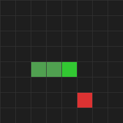

# Snake DQN Multi-Env



A reinforcement learning project that trains a DQN agent to play Snake on an 8x8 (or larger) grid, using a CNN-based **Dueling Double DQN** with **NoisyNet** exploration and optional multi-environment (vectorized) parallel training.

## Overview

The project contains two Snake DQN variants:

1. **`snake_dqn_8_multi/`** -- Multi-environment variant (primary). Spawns N parallel game workers via Python multiprocessing, feeds batched observations to the network, and runs 4 replay updates per step. Supports best-model tracking and CSV metric logging.

2. **`snake_dqn_88/`** -- Single-environment variant. Trains one game at a time with a 9-channel CNN observation, Dueling DQN + NoisyNet + Double DQN. Good for quick experiments and visual rendering.

## Architecture

```
                   +------------------+
                   |   train.py       |  <-- Entry point (CLI)
                   +--------+---------+
                            |
              +-------------+-------------+
              |                           |
   (num_envs == 1)              (num_envs > 1)
              |                           |
     +--------v--------+      +----------v-----------+
     |   SnakeGame      |      |   VecSnakeEnv        |
     |   (single env)   |      |   (N worker procs)   |
     +--------+---------+      |   each runs SnakeGame|
              |                +----------+-----------+
              |                           |
              +-------------+-------------+
                            |
                   +--------v--------+
                   |    Agent         |
                   |  (Double DQN,   |
                   |   NoisyNet,     |
                   |   Dueling)      |
                   +--------+--------+
                            |
                   +--------v--------+
                   |    DQN Model    |
                   |  Conv2d(9,64)   |
                   |  Conv2d(64,128) |
                   |  AvgPool2d(2)   |
                   |  FC -> 512      |
                   |  Dueling Head   |
                   |  (NoisyLinear)  |
                   +-----------------+
```

### State Representation (9 channels, HxW)

| Channel | Content |
|---------|---------|
| 0 | Snake body/head (binary) |
| 1 | Food position (binary) |
| 2 | Empty cells (binary) |
| 3 | Food X coordinate (constant plane, normalized) |
| 4 | Food Y coordinate (constant plane, normalized) |
| 5-8 | Current direction one-hot (UP/DOWN/LEFT/RIGHT) |

### Reward Shaping

- **Each step:** -0.005 base penalty
- **Moving closer to food:** +0.05 * distance_reduction
- **Distance penalty:** -0.02 * (distance / max_distance)
- **No progress for 20 steps:** -1.0 penalty
- **Eating food:** +20.0 + 0.5 * current_score (increasing reward)
- **Death (wall/body/timeout):** -25.0

## Quick Start

1. Clone and install:
   ```bash
   git clone https://github.com/Beba-ai-ml/snake-dqn-multi-env.git
   cd snake-dqn-multi-env
   python3 -m venv .venv
   source .venv/bin/activate
   pip install -r requirements.txt
   ```

2. Train with multi-env (recommended, 8 parallel envs by default):
   ```bash
   python -m snake_dqn_8_multi.train --episodes 1000 --num-envs 8 --save-every 500 --session-id 1
   ```

3. Train single-env with rendering:
   ```bash
   python -m snake_dqn_88.train --episodes 100 --render-every 1 --fps 8
   ```

4. Resume training from a checkpoint:
   ```bash
   python -m snake_dqn_8_multi.train --episodes 1000 --session-id 13
   ```
   (Automatically loads `checkpoints_8_multi/session_13.pth` if it exists.)

## CLI Parameters

| Parameter | Default | Description |
|-----------|---------|-------------|
| `--episodes` | 100 | Number of training episodes |
| `--num-envs` | 8 | Number of parallel environments (multi-env only) |
| `--grid-size` | 8 | Grid dimensions (NxN) |
| `--render-every` | 0 | Render every N episodes (0=off, single-env only) |
| `--fps` | 8 | Pygame animation speed |
| `--gamma` | 0.99 | Discount factor |
| `--lr` | 1e-4 | Learning rate (Adam) |
| `--batch-size` | 256 | Replay batch size |
| `--epsilon-start` | 0.01 | Initial epsilon (kept minimal; NoisyNet handles exploration) |
| `--epsilon-min` | 0.01 | Minimum epsilon |
| `--epsilon-decay` | 1.0 | Epsilon decay rate |
| `--seed` | 42 | RNG seed (-1 to disable, multi-env only) |
| `--save-every` | 0 | Save checkpoint every N episodes (0=off) |
| `--save-dir` | checkpoints_8_multi | Checkpoint output directory |
| `--session-id` | 1 | Session number for checkpoint naming |
| `--load-from` | None | Path to a .pth file to load weights from |

## Pretrained Model

A pretrained best model is included in `pretrained/`:

- **File:** `pretrained/session_13_best.pth` (~20 MB)
- **Grid:** 16x16
- **Mean score (100 episodes):** 25.37
- **Training:** 22,066 episodes with 32 parallel environments

To use the pretrained model:
```bash
python -m snake_dqn_8_multi.train --load-from pretrained/session_13_best.pth --grid-size 16 --episodes 100
```

## Training Results

CSV logs from training sessions are in `results/`. Each file contains per-episode metrics: episode, score, mean_20, mean_100, epsilon, loss.

## Project Structure

```
snake_dqn_8_multi/          # Multi-env DQN package (primary)
    __init__.py
    agent.py                # DQN agent with batch inference + Double DQN
    game.py                 # Snake environment with 9-channel CNN state
    model.py                # Dueling DQN + NoisyNet (dynamic grid size)
    train.py                # Training loop with vectorized multi-env support
snake_dqn_88/               # Single-env DQN package (baseline)
    __init__.py
    agent.py                # Simpler single-env agent
    game.py                 # Snake environment (same API, different step limit)
    model.py                # Dueling DQN + NoisyNet (fixed 8x8 grid)
    train.py                # Single-env training loop
pretrained/                 # Best pretrained model weights
results/                    # Training CSV logs
requirements.txt            # Python dependencies
```

## Key Design Decisions

- **NoisyNet** replaces epsilon-greedy exploration entirely (epsilon fixed at 0.01)
- **Dueling architecture** separates state value from action advantage
- **Double DQN** uses main network for action selection, target network for evaluation
- **Soft target update** (Polyak averaging, tau=0.01) instead of periodic hard copy
- **Multi-env** collects experience from N games simultaneously, runs 4 replay updates per step
- **Replay buffer:** 300k transitions (multi-env) or 100k (single-env)

## License

MIT License. See [LICENSE](LICENSE) for details.
